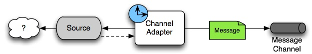

# Spring Integration (SI)
ESDE Workshop\
2021-12-07

Daniyal Kz - Paul Severin

[GitHub Repo](https://github.com/sebivenlo/ESDE-2021-Spring-Integration)

<!-- s -->
## Workshop structure
1. Context
1. Solution
1. Where does Spring Integration comes to the picture?
1. Why use SI?
1. SI terminologies
1. Break (5 minute)
1. Quiz
1. Assignment
1. Assignment solution & Questions

<!-- s -->
## Context

- Enterprise applications are developed over time<!-- .element: class="fragment fade-up" -->
- Distributed across multiple domains (e.g: Payroll, inventory, reporting)<!-- .element: class="fragment" -->
- Each module developed independent of each other<!-- .element: class="fragment" -->
- Interaction between modules and external systems<!-- .element: class="fragment" -->
- Software grows old, new platforms need to be integrated for maintenance<!-- .element: class="fragment" -->
- Complexity in integrating these modules inside organizations or with external partners<!-- .element: class="fragment" -->
- It requires integration of heterogeneous endpoints<!-- .element: class="fragment" -->

<!-- s -->
## Solution
- Enterprise Integration Patterns (EIP)<!-- .element: class="fragment fade-up" -->
- Collection of standard enterprise challenges and how can they be handled<!-- .element: class="fragment fade-up" -->
- Messaging technique<!-- .element: class="fragment fade-up" -->
- Two heterogeneous modules can interact through data over a predefined connection<!-- .element: class="fragment fade-up" --> 
- Done in a Asynchronous model<!-- .element: class="fragment fade-up" --> 
- Provides decoupling, modules are independent on the availability of the other <!-- .element: class="fragment fade-up" --> 
- They can participate or withdraw from integration without impacting other components <!-- .element: class="fragment fade-up" --> 

<!-- s -->
## Where Spring Integration comes to the picture?
- Spring Integration is based on the messaging paradigm <!-- .element: class="fragment fade-up" -->
- Multiple endpoints connect on to a channel, produce or consume messages, and perform further processing based on information in a message <!-- .element: class="fragment" -->
- Easily integrate with Message brokers such as RabbitMQ or ActiveMQ<!-- .element: class="fragment" -->
- Enables lightweight messaging within Spring-based applications<!-- .element: class="fragment" -->
- Supports integration with external systems  via declarative adapters<!-- .element: class="fragment" -->
- Maintains the separation of concerns<!-- .element: class="fragment" -->

<!-- s -->
## Why use it?
- Motivated by the same goals and principles as the Spring framework<!-- .element: class="fragment" -->
- Programming to interfaces<!-- .element: class="fragment" -->
- Favor composition over inheritance<!-- .element: class="fragment" -->

<!-- s -->
## Messaging pattern
- EIP defines patterns for many integration challenges<!-- .element: class="fragment" -->
- Exchange of messages between heterogeneous systems<!-- .element: class="fragment" -->
- Three aspect of messaging<!-- .element: class="fragment" -->
  - Message being exchanged<!-- .element: class="fragment fade-up" -->
  - The endpoints that participate<!-- .element: class="fragment fade-up" -->
  - The medium through which messages are delivered<!-- .element: class="fragment fade-up" -->
- In EIP: <!-- .element: class="fragment" -->
  - Messages <!-- .element: class="fragment fade-up" -->
  - Message endpoints <!-- .element: class="fragment fade-up" -->
  - Message channels <!-- .element: class="fragment fade-up" -->

<!-- s -->
## Message
A generic container for data

<!-- .element: class="fragment fade-up" -->
- Header: contains metadata (E.g. id and timestamp)<!-- .element: class="fragment" -->
- Payload: could be any type of data (E.g. Java Object, XML) <!-- .element: class="fragment" -->

<!-- s -->
## Message endpoints
- Communication happens between two components<!-- .element: class="fragment fade-up" -->
- Endpoints make the handshake transparent and seamless between two heterogenous components. <!-- .element: class="fragment fade-up" -->
- Two type: <!-- .element: class="fragment" -->
  1. Producer endpoint
  1. Consumer endpoint
- Endpoints can have functionality and act on the messages<!-- .element: class="fragment" -->
  - Validate
  - Route
  - Filter
  - Aggregate
  - Transform
  - etc.


<!-- s -->
## Message Channel
- Endpoints do not need to be aware of each others type<!-- .element: class="fragment fade-up" -->
- They register with channels<!-- .element: class="fragment" -->
  
  <!-- .element: class="fragment fade-up" --> 
- A channel is responsible to deliver the messages between endpoints <!-- .element: class="fragment" -->
- Two types:<!-- .element: class="fragment" -->
  1. Point-to-point channel 
  1. Publish-subscribe channel

<!-- s -->
## Endpoints: Channel Adapter
- Connects a channel to some other system
  - Two types:<!-- .element: class="fragment" -->
  1. Inbound (source endpoint) - to receive messages from external sources <!-- .element: class="fragment" -->  

   <!-- .element: class="fragment fade-down" -->

  2. Outbound (target endpoint)- to send messages from the Spring Integration to external systems <!-- .element: class="fragment fade-up" -->
  
  <!-- .element: class="fragment fade-down" -->

<!-- s -->
## Endpoints: Channel Adapter continued
- Out of the box adapters in SI: <!-- .element: class="fragment" -->
  - Databases
  - Message queues
  - Email services
  - Social applications such as Twitter
  - File systems
  - etc.

<!-- s -->
## Endpoints: Transformers
- Transformation of messages enables them to be consumed across a chain <!-- .element: class="fragment fade-up" -->
- data needs to be viewed by different context <!-- .element: class="fragment" -->
- For example: information must be augmented in the original message <!-- .element: class="fragment" -->
  - need to encrypt/decrypt <!-- .element: class="fragment" -->
  - or converted to some proprietary format <!-- .element: class="fragment" -->
- Message transformers are a practical design to decouple message producers and message consumers <!-- .element: class="fragment" -->
- SI provides out-of-the-box transformers such as exchange between XML and JSON formats <!-- .element: class="fragment" -->

<!-- s -->
## Message flow endpoints
- After transformation is done, SI provides seamless flow of messages across heterogenous components <!-- .element: class="fragment fade-up" -->
  - Routers 
  - Filters
  - Splitters
  - Aggregators

<!-- s -->
## Routers
- Components that pick messages from a channel<!-- .element: class="fragment fade-up" -->
- Depending on a set of pre-defined rules, deliver them to different channels<!-- .element: class="fragment" -->

- SI provides built-in routers: <!-- .element: class="fragment" -->
  - Payload-type router
  - Header value router
  - Recipient list router
  - etc.

<!-- s -->
## Filters
- Components that take a boolean decision, whether to pass data or not <!-- .element: class="fragment fade-up" -->
- Two ways to define message filter <!-- .element: class="fragment" -->
  - Write simple Java class and define its methods to take these decisions <!-- .element: class="fragment" -->
  - Configure it as a message endpoint that delegates to an implementation of the <!-- .element: class="fragment" --> `messageSelectorInterface` <!-- .element: class="fragment" -->

<!-- s -->
## Code test

```java [1-2|3|4]
System.out.println("never use System.out.println at home");
System.out.println("never use System.out.println at home");
System.out.println("never use System.out.println at home");
System.out.println("never use System.out.println at home");
System.out.println("never use System.out.println at home");
System.out.println("never use System.out.println at home");
System.out.println("never use System.out.println at home");
```
<!-- .element: class="fragment" style="font-size: 0.50em !important;" -->

<!-- s -->
# Break
5'

<!-- s -->
# Quiz
<!-- TODO Link to quiz and code -->

<!-- s -->
# Assignments

<!-- s -->
## Instructions


<!-- s -->
## Solution & Questions

